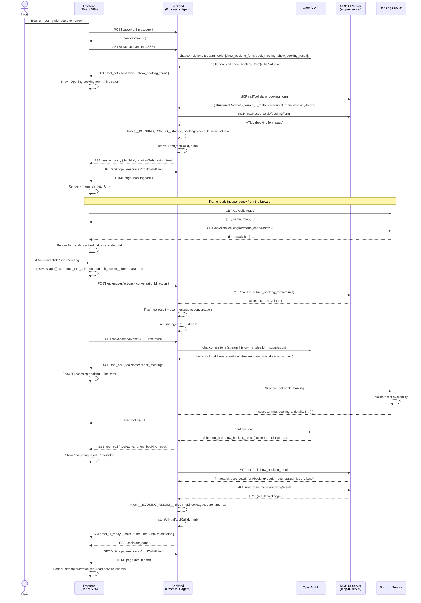

# MCP UI App Example

A reference implementation of an **AI chat assistant with interactive UI forms** delivered via the [Model Context Protocol (MCP)](https://modelcontextprotocol.io/). The agent books meetings with colleagues through a multi-step flow: it presents an interactive HTML booking form inside the chat, waits for the user to fill it out, calls a backend booking service, and then renders a read-only result card — all orchestrated through MCP tools and SSE streaming.

---

## Demo

<video src="docs/demo.mp4" controls width="100%"></video>

---

## Quick Start

### Prerequisites

- [Docker](https://docs.docker.com/get-docker/) and [Docker Compose](https://docs.docker.com/compose/)
- An OpenAI API key

### 1. Configure environment

```bash
cp .env.example .env   # or create .env manually
```

`.env`:
```env
OPENAI_API_KEY=sk-...
OPENAI_MODEL=gpt-4o    # optional, defaults to gpt-4o
```

### 2. Build images

```bash
docker compose build
```

> Images are built once. After that, source code is mounted as volumes so changes take effect immediately — no rebuild needed.

### 3. Run

```bash
docker compose up
```

Open **http://localhost:5173** in your browser.

To stop:

```bash
docker compose down
```

---

## Architecture Overview

```
┌─────────────────────────────────────────────────────────┐
│                    Browser (port 5173)                  │
│              React SPA — Vite dev server                │
└───────────────────────┬─────────────────────────────────┘
                        │ HTTP / SSE
┌───────────────────────▼─────────────────────────────────┐
│              Backend API  (port 3000)                   │
│   Express · OpenAI streaming · MCP client · SSE fanout  │
└──────────────┬───────────────────────┬──────────────────┘
               │ MCP/HTTP              │ MCP/HTTP
┌──────────────▼──────────┐  ┌────────▼─────────────────┐
│   MCP UI Server (3011)  │  │  Booking Service (3002)   │
│  show_booking_form      │  │  book_meeting             │
│  submit_booking_form    │  │  /api/colleagues           │
│  show_booking_result    │  │  /api/slots                │
│  ui://booking/form  ◄───┘  │  /mcp (MCP endpoint)      │
│  ui://booking/result    │  └──────────────────────────┘
└─────────────────────────┘
```

---

## Services

### frontend — React SPA

**Port:** 5173 (Vite dev server)

The user-facing chat interface. Built with React, TypeScript, and Tailwind CSS.

Key responsibilities:
- Renders a chat thread with user messages, assistant text (streamed token-by-token), tool status indicators, and embedded UI cards.
- Opens an **SSE** connection to the backend after each message to receive streaming events.
- Renders interactive booking forms in `<iframe>` elements when the backend emits a `tool_ui_ready` event.
- Calls `POST /api/mcp-ui/actions` when the user submits a form inside the iframe (via `postMessage`).

Key files:

| File | Purpose |
|---|---|
| `src/hooks/useChat.ts` | Core hook: SSE event handling, `sendMessage`, `submitForm`, `newChat` |
| `src/components/MessageList.tsx` | Renders the message thread |
| `src/components/McpFormMessage.tsx` | Wraps the tool UI card (header + iframe) |
| `src/components/McpFormFrame.tsx` | `<iframe>` with `postMessage` bridge; filters resize events by `event.source` |
| `src/components/ChatInput.tsx` | Textarea with auto-resize |
| `src/components/AssistantMessage.tsx` | Streamed text + tool activity indicator |

---

### backend — Express API + Agent Orchestrator

**Port:** 3000

The central coordinator between the frontend, OpenAI, and MCP servers.

**REST endpoints:**

| Method | Path | Description |
|---|---|---|
| `POST` | `/api/chat` | Start or continue a conversation; runs the agent loop |
| `GET` | `/api/chat/:id/events` | SSE stream for a conversation |
| `POST` | `/api/mcp-ui/actions` | Receive form submission from frontend; resume the agent |
| `GET` | `/api/mcp-ui/resources/:toolCallId/view` | Serve stored HTML for an iframe |

**SSE event types:**

| Event | Payload | Description |
|---|---|---|
| `assistant_delta` | `{ content }` | Streaming text chunk from the LLM |
| `assistant_done` | — | LLM turn complete |
| `tool_call` | `{ toolName, toolInput }` | Agent is calling a tool |
| `tool_result` | `{ toolName, result }` | Non-UI tool result (informational) |
| `tool_ui_ready` | `{ toolCallId, fetchUrl, requiresSubmission, … }` | An HTML UI card is ready |
| `error` | `{ message }` | Agent or MCP error |

Key files:

| File | Purpose |
|---|---|
| `src/services/agentOrchestrator.ts` | OpenAI streaming loop; MCP tool dispatch; SSE fanout |
| `src/services/mcpClient.ts` | Shared MCP session; tool routing to ui/booking servers |
| `src/services/sessionStore.ts` | In-memory conversation state |
| `src/services/uiHtmlStore.ts` | Short-lived store for rendered HTML (30 min TTL) |

---

### mcp-ui-server — UI MCP Server

**Port:** 3011 (mapped from internal 3001)

Implements MCP tools that return HTML UI to the user as part of the agent's response. Follows the [MCP UI extension pattern](https://modelcontextprotocol.io/): tools return `_meta.ui.resourceUri` pointing to an MCP resource, which the backend fetches and renders in an iframe.

**Tools:**

| Tool | Visibility | Description |
|---|---|---|
| `show_booking_form` | model + app | Returns a resource URI for the interactive booking form |
| `submit_booking_form` | app only | Accepts validated form data submitted from the iframe |
| `show_booking_result` | model + app | Returns a resource URI for the read-only result card |

**Resources:**

| URI | Description |
|---|---|
| `ui://booking/form` | Self-contained HTML booking form page |
| `ui://booking/result` | Self-contained HTML result card (success or failure) |

The `submit_booking_form` tool is filtered from the OpenAI tool list by the backend (its `_meta.ui.visibility` only includes `"app"`). The iframe calls it indirectly via `postMessage → backend → MCP`.

---

### booking-service — Calendar & Booking REST + MCP Server

**Port:** 3002

Provides two interfaces:
1. **REST API** — used by the booking form iframe to load colleagues and available slots.
2. **MCP server** (`/mcp`) — used by the backend agent to perform the actual booking.

**REST endpoints:**

| Method | Path | Description |
|---|---|---|
| `GET` | `/api/colleagues` | List of available colleagues with roles |
| `GET` | `/api/slots?colleague=&date=` | Available 30-minute time slots for a given day |

**MCP tools:**

| Tool | Description |
|---|---|
| `book_meeting` | Validates slot availability (deterministic mock) and creates a booking ID |

Slot availability is **deterministic and mockable**: derived from a hash of `colleague + date + slot index`. Approximately 40% of slots are marked unavailable, consistently across restarts.

Colleagues:

| ID | Name | Role |
|---|---|---|
| `alex_morgan` | Alex Morgan | Senior Developer |
| `maria_chen` | Maria Chen | Product Manager |
| `david_kim` | David Kim | UX Designer |
| `elena_ross` | Elena Ross | QA Engineer |
| `ivan_petersen` | Ivan Petersen | DevOps Engineer |

---

## Sequence Diagram

The full interaction for a successful meeting booking:



---

## Key Design Decisions

### MCP UI Extension Pattern

Standard MCP tools return structured data for the model to process. This app extends that pattern: certain tools also return `_meta.ui.resourceUri` pointing to an MCP resource. When the backend sees this field, it:

1. Fetches the HTML page from the MCP resource endpoint
2. Injects runtime data (`__BOOKING_CONFIG__` or `__BOOKING_RESULT__`) directly into the HTML before the inline script runs
3. Stores the HTML in `uiHtmlStore` (keyed by `toolCallId`)
4. Emits a `tool_ui_ready` SSE event with a `fetchUrl` for the frontend to load into an `<iframe>`

The result: the agent can show fully interactive or read-only HTML UI inside the chat thread, tightly controlled by MCP tool responses.

### requiresSubmission flag

Tools expose `_meta.ui.requiresSubmission` in their response:

- **`true`** (default, e.g. `show_booking_form`): The agent loop **pauses**. The backend stores `pendingToolCallId` and waits for `POST /api/mcp-ui/actions` before resuming. OpenAI is not called again until the form is submitted.
- **`false`** (e.g. `show_booking_result`): The agent loop **does not pause**. The result is pushed to conversation history immediately, the UI card is shown, and `assistant_done` is emitted. No further LLM turn is triggered, preventing duplicate text after a read-only card.

### Shared MCP Session

Each MCP server connection requires an HTTP handshake (initialize + SSE setup). To avoid repeating this on every request, the backend creates a single persistent `McpClientSession` per MCP server, reused across all conversations.

The client manages **two** MCP sessions:
- `uiClient` → mcp-ui-server (UI tools + resources)
- `bookingClient` → booking-service (booking tool)

A `toolOwner` map (populated on `listTools()`) routes each `callTool` call to the correct client. `readResource` always goes to `uiClient` since only UI resources exist.

On error, `resetSharedSession()` clears the singleton so the next request reconnects cleanly.

### Tool Visibility Filtering

`submit_booking_form` is an internal tool meant only for the iframe, not for the AI model. Its `_meta.ui.visibility` is set to `["app"]`. The backend filters it from the OpenAI tool list before every completion request, so the model never knows it exists and cannot call it directly.

### Iframe Isolation

Each `McpFormFrame` listens for `postMessage` events from its own iframe only:

```ts
if (event.source !== iframeRef.current?.contentWindow) return;
```

This prevents resize events from a new form affecting already-submitted (older) iframe instances in the same chat thread.

### Cancelling Pending Tool Calls

If the user sends a new message while a form is still open (not yet submitted), the backend detects unresolved `tool_call` entries in conversation history and injects synthetic `role: "tool"` cancellation messages. This keeps the OpenAI message history valid (every `tool_call` must have a matching `tool` result) and lets the new turn proceed cleanly.

### Deterministic Slot Availability

Slot availability is computed with a simple hash of `colleague + date + slot_index`. This makes the mock data stable across service restarts — the same request always returns the same availability, which makes demos reproducible without a real calendar backend.

---

## Project Structure

```
mcp_ui_app_example/
├── docker-compose.yml
├── frontend/                  # React SPA (Vite + Tailwind)
│   └── src/
│       ├── hooks/useChat.ts   # SSE + API calls
│       └── components/        # UI components
├── backend/                   # Express API + agent orchestrator
│   └── src/
│       ├── routes/            # chat.ts, mcpUi.ts
│       └── services/          # agentOrchestrator, mcpClient, sessionStore, uiHtmlStore
├── mcp-ui-server/             # MCP server: UI tools + HTML resources
│   └── src/
│       ├── tools/             # show_booking_form, submit_booking_form, show_booking_result
│       └── templates/         # bookingForm.ts, bookingResult.ts (HTML generators)
└── booking-service/           # REST API + MCP server: calendar mock
    └── src/
        ├── data.ts            # Colleagues list + deterministic slot generator
        ├── index.ts           # Express app + /mcp endpoint
        └── mcpServer.ts       # book_meeting MCP tool
```

---

## Environment Variables

| Variable | Service | Default | Description |
|---|---|---|---|
| `OPENAI_API_KEY` | backend | — | Required. Your OpenAI API key |
| `OPENAI_MODEL` | backend | `gpt-4o` | Model to use |
| `MCP_UI_SERVER_URL` | backend | `http://mcp-ui-server:3001/mcp` | MCP UI server endpoint |
| `BOOKING_MCP_URL` | backend | `http://booking-service:3002/mcp` | Booking service MCP endpoint |
| `BOOKING_SERVICE_URL` | backend | `http://booking-service:3002` | Internal booking service base URL |
| `PUBLIC_BOOKING_URL` | backend | `http://localhost:3002` | Public URL injected into iframe HTML for browser access |
| `BOOKING_SERVICE_URL` | mcp-ui-server | `http://localhost:3002` | Used in form HTML as the API base URL |

---

## Development

Source directories are mounted as Docker volumes, so edits apply instantly without rebuilding:

```
./backend/src        → /app/src  (ts-node --transpile-only watches for restarts)
./mcp-ui-server/src  → /app/src
./booking-service/src → /app/src
./frontend/src       → /app/src  (Vite HMR)
```

To rebuild images after changing `package.json` or `Dockerfile`:

```bash
docker compose build <service-name>
docker compose up
```

To view logs for a specific service:

```bash
docker compose logs -f backend
docker compose logs -f mcp-ui-server
```
