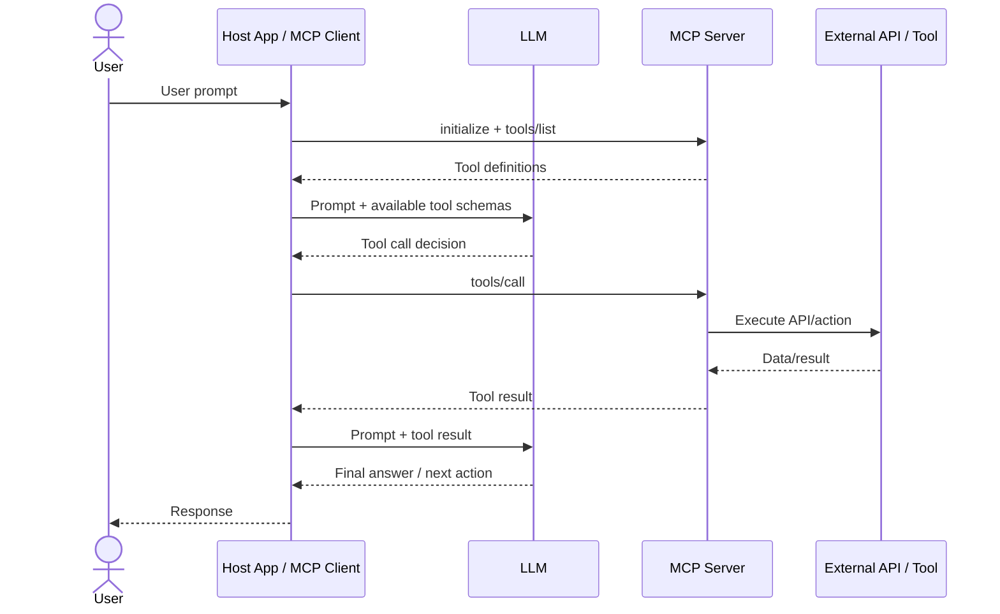
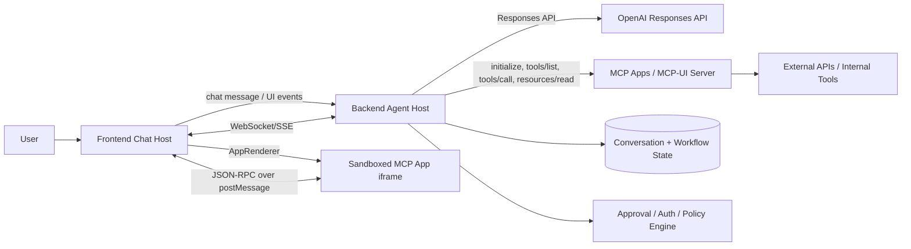
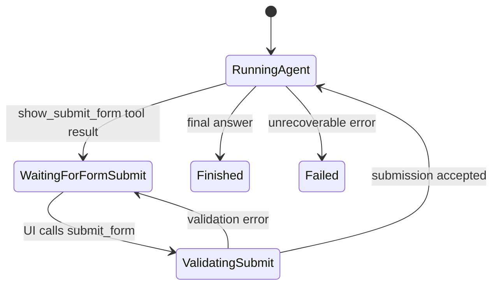
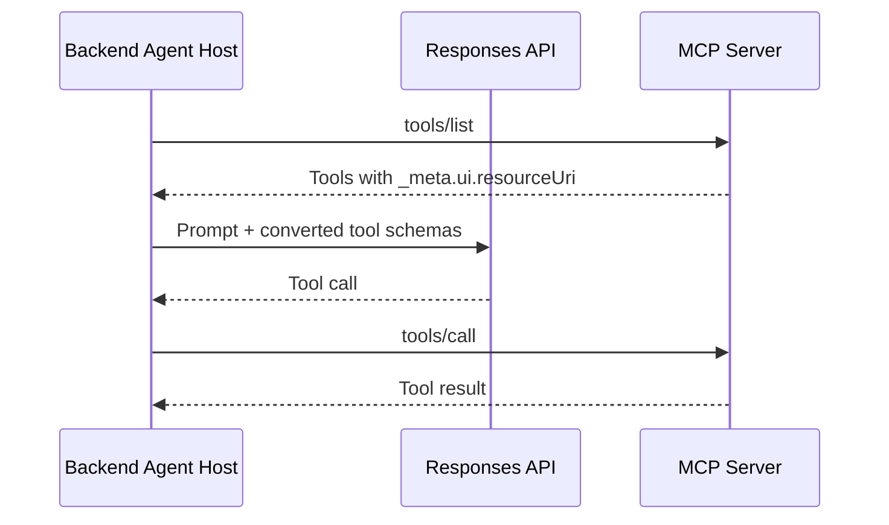
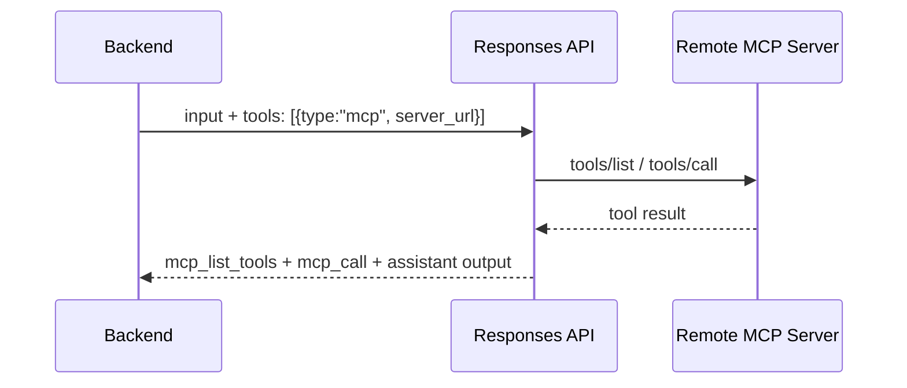
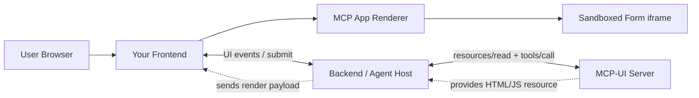
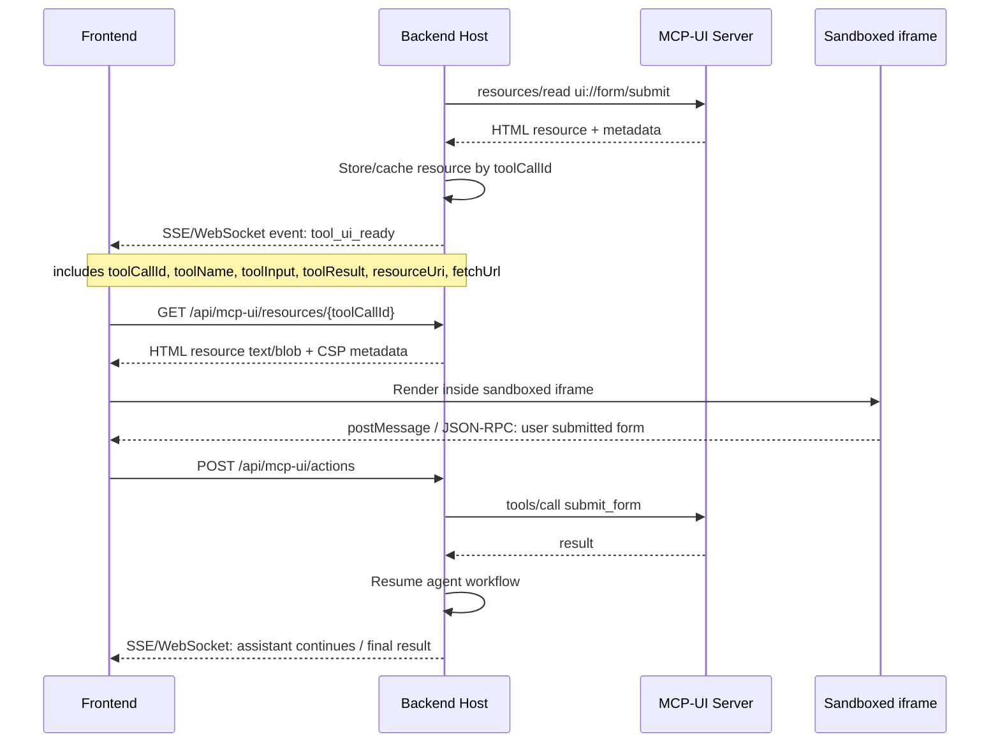
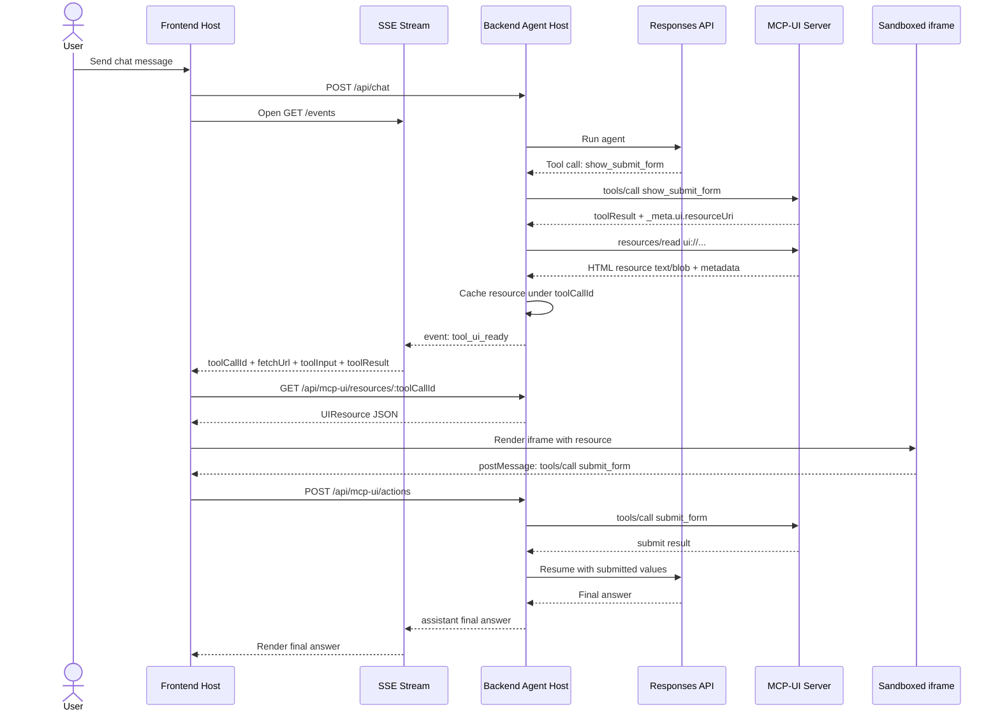

## 1. Your basic MCP tool-call sequence is mostly correct

Your diagram is correct for a **classic agent-controlled MCP flow**:



The main corrections:

1. **“Client” in MCP terminology is your host application**, not the end-user frontend only. In your case it is probably your backend agent orchestrator plus frontend renderer.

2. **Tool discovery happens before the model call**: `initialize`, `tools/list`, sometimes `resources/list`.

3. **The LLM does not call MCP directly** in the classic architecture. The host/agent runtime receives the model’s tool-call request and performs `tools/call`.

4. With **OpenAI Responses API hosted MCP**, OpenAI can act as the MCP client for model-side tool calls: you provide an MCP server URL in the `tools` parameter, and the API lists and calls tools itself. The Responses API returns `mcp_list_tools` and `mcp_call` output items. OpenAI docs say remote MCP servers must support Streamable HTTP or HTTP/SSE, and tool calls appear as `mcp_call` items in the response. ([OpenAI Developers][1])

---

## 2. What changes with MCP Apps / MCP-UI

MCP Apps adds a **UI layer attached to a tool**. A tool can declare:

```json
{
  "_meta": {
    "ui": {
      "resourceUri": "ui://my-server/submit-form"
    }
  }
}
```

The official MCP Apps pattern is: a tool declares `_meta.ui.resourceUri`; the host fetches that resource via `resources/read`; then the host renders it in a sandboxed iframe and enables bidirectional communication over JSON-RPC via `postMessage`. ([Model Context Protocol][2])

MCP-UI implements this standard. Its docs describe the three core pieces as: a tool with `_meta.ui.resourceUri`, a resource handler, and a client `AppRenderer` that fetches and renders the UI. ([mcpui.dev][3])

So the architecture is not:

> MCP server returns a form to the LLM.

It is:

> MCP server exposes a tool + UI resource. The **host app** renders the UI. The LLM only sees tool schemas, structured results, and model-visible UI state/events.

---

## 3. Recommended architecture for your system

Given your components:

* **Frontend**: chat UI + MCP Apps renderer.
* **Backend**: agent orchestrator, Responses API calls, MCP client/proxy, state machine.
* **LLM**: OpenAI Responses API.
* **MCP-UI / MCP Apps server**: exposes tools and `ui://...` resources.
* **External services**: APIs, DB, internal tools.
* **Additional needed pieces**:

  * sandbox iframe proxy;
  * persistent workflow/session store;
  * event stream between backend and frontend, usually WebSocket or SSE;
  * tool/resource cache;
  * approval/permission layer;
  * UI-submission/resume controller.

High-level architecture:



The **Frontend is part of the MCP Apps host**, because it renders the iframe and handles `postMessage`. The **Backend is also part of the host**, because it proxies MCP tool/resource calls, controls workflow state, and resumes the agent after user submission.

---

## 4. Sequence diagram: agent shows form, user submits, agent continues

This is the important flow for your use case.

```mermaid
sequenceDiagram
    actor User
    participant FE as Frontend Host
    participant BE as Backend Agent Host
    participant LLM as Responses API / LLM
    participant MCP as MCP Apps Server
    participant UI as Sandboxed Form iframe
    participant EXT as External API / Tool
    participant DB as Workflow State DB

    User->>FE: "Prepare search/report/deployment/etc."
    FE->>BE: Send user message
    BE->>DB: Create/update conversation state

    BE->>MCP: initialize + tools/list
    MCP-->>BE: Tools incl. show_form with _meta.ui.resourceUri

    BE->>LLM: Prompt + available tool info
    LLM-->>BE: Decide to call show_form(args)

    BE->>MCP: tools/call show_form(args)
    MCP-->>BE: Tool result: structuredContent + content
    Note over MCP,BE: Tool has _meta.ui.resourceUri = ui://.../submit-form

    BE->>MCP: resources/read ui://.../submit-form
    MCP-->>BE: HTML resource text/blob + _meta.ui.csp

    BE->>DB: Store pending_human_input state
    BE-->>FE: Render tool result + UI resource metadata/data

    FE->>UI: Load HTML in sandbox iframe
    UI->>FE: ui/initialize via postMessage
    FE-->>UI: Host capabilities + theme + context
    FE->>UI: ui/notifications/tool-input/tool-result

    User->>UI: Chooses parameters + clicks Submit

    UI->>FE: tools/call submit_form(args) via postMessage
    FE->>BE: Proxy UI tool call
    BE->>MCP: tools/call submit_form(args)
    MCP->>EXT: Optional validation / save / API call
    EXT-->>MCP: Result
    MCP-->>BE: Submission accepted/result

    BE->>DB: Mark form submitted; store selected params
    BE->>LLM: Continue conversation with submitted params/tool result
    LLM-->>BE: Next tool call or final answer

    alt Needs more execution
        BE->>MCP: tools/call execute_action(params)
        MCP->>EXT: Execute
        EXT-->>MCP: Result
        MCP-->>BE: Result
        BE->>LLM: Send tool result
        LLM-->>BE: Final response
    end

    BE-->>FE: Final response / next UI
    FE-->>User: Show answer
```

This is the cleanest pattern: **the agent pauses logically**, not by keeping one LLM request open forever. You persist a `pending_human_input` state, render the form, and when the user submits, the backend resumes the workflow with a new Responses API call.

---

## 5. Tool design for your form use case

You probably want at least two MCP tools.

### Model-visible tool: `show_submit_form`

Visible to the model. The LLM calls it when it decides the user should configure something visually.

```ts
registerAppTool(server, "show_submit_form", {
  description: "Show a form to collect parameters before continuing execution.",
  inputSchema: {
    type: "object",
    properties: {
      title: { type: "string" },
      initialValues: { type: "object" },
      fields: { type: "array" }
    },
    required: ["title", "fields"]
  },
  _meta: {
    ui: {
      resourceUri: "ui://agent/forms/submit-parameters",
      visibility: ["model", "app"]
    }
  }
}, async (args) => {
  return {
    structuredContent: {
      formId: crypto.randomUUID(),
      title: args.title,
      fields: args.fields,
      initialValues: args.initialValues ?? {}
    },
    content: [
      { type: "text", text: "Please review and submit the parameters." }
    ]
  };
});
```

### App-only tool: `submit_form`

Callable from the iframe, hidden from the model if you do not want the model to call it directly. The MCP Apps spec supports `_meta.ui.visibility`; tools without `"model"` should not be included in the model tool list. ([GitHub][4])

```ts
registerAppTool(server, "submit_form", {
  description: "Submit form values selected by the user.",
  inputSchema: {
    type: "object",
    properties: {
      formId: { type: "string" },
      values: { type: "object" }
    },
    required: ["formId", "values"]
  },
  _meta: {
    ui: {
      visibility: ["app"]
    }
  }
}, async ({ formId, values }) => {
  // validate, persist, maybe call external API
  return {
    structuredContent: {
      formId,
      accepted: true,
      values
    },
    content: [
      { type: "text", text: "Form submitted." }
    ]
  };
});
```

The iframe can call `submit_form` through `tools/call`. OpenAI’s Apps SDK docs describe the same standard bridge: JSON-RPC over `postMessage`, `ui/notifications/tool-result`, and `tools/call` for UI-initiated tool calls. ([OpenAI Developers][5])

---

## 6. Frontend host responsibilities

Your frontend needs more than “display iframe”:

1. Use `@mcp-ui/client` `AppRenderer`, or implement the vanilla MCP Apps bridge yourself.
2. Render the UI inside a sandboxed iframe.
3. Run a sandbox proxy page if your host is web-based. The MCP Apps spec says a web host must wrap the view and communicate through an intermediate sandbox proxy with different origins. ([GitHub][4])
4. Forward `ui/initialize`, `tools/call`, `resources/read`, `ui/message`, and `ui/update-model-context` events to backend where needed.
5. Enforce URL opening rules, CSP, size updates, and permissions.
6. Never trust arbitrary UI HTML from third-party MCP servers.

MCP-UI’s `AppRenderer` can fetch resources through an MCP client, or you can provide callbacks like `onReadResource` and `onCallTool` that call your backend. ([mcpui.dev][6])

---

## 7. Backend host responsibilities

Your backend should own the actual agent state:



Backend modules:

| Module             | Responsibility                                                        |
| ------------------ | --------------------------------------------------------------------- |
| Agent Orchestrator | Calls Responses API, tracks current step, decides when to resume      |
| MCP Client/Proxy   | `initialize`, `tools/list`, `tools/call`, `resources/read`            |
| UI Event Gateway   | Receives iframe actions from frontend                                 |
| Workflow Store     | Conversation state, pending forms, tool results                       |
| Approval Engine    | Blocks sensitive tool calls until approved                            |
| Resource Security  | CSP validation, domain allowlist, HTML/resource caching               |
| Streaming Gateway  | Sends assistant text, tool events, and UI render commands to frontend |

Security is not optional here. OpenAI’s MCP guidance warns that MCP servers define their own tool behavior and may receive sensitive data; it recommends approvals, trusted servers, and logging/review of data shared with MCP servers. ([OpenAI Developers][1])

---

## 8. Important Responses API architecture choice

You have two viable designs.

### Option A — Backend is the MCP client/host

This is my recommended architecture for your own product.



Pros:

* Full control over UI metadata.
* Full control over `resources/read`.
* Easier to implement MCP Apps host behavior.
* Easier to pause/resume workflows.
* Easier security review and audit.

Cons:

* You must implement the agent tool loop yourself.

### Option B — Responses API hosted MCP calls the MCP server



Pros:

* Less tool-loop code.
* OpenAI handles MCP listing/calling.

Cons for MCP Apps:

* Your frontend still must render UI.
* Your backend still needs access to resource metadata and `resources/read`.
* You need to map `mcp_call` results to UI rendering events.
* You may need a parallel MCP client in your backend anyway to read UI resources and app-only tools.

So for MCP Apps in your own UI, **do not rely only on hosted MCP**. Use your backend as an MCP Apps host/proxy, even if you also use Responses API hosted MCP for some simple non-UI tools.

---

## 9. My practical recommendation

For your “show a web submit form → user submits → agent continues” case, implement:

```text
Frontend
  Chat UI
  Tool message renderer
  @mcp-ui/client AppRenderer
  sandbox_proxy.html
  WebSocket/SSE client

Backend
  Conversation controller
  Responses API caller
  MCP client/proxy
  Workflow state machine
  Approval/security layer
  UI event endpoint

MCP Apps Server
  show_submit_form tool
  submit_form app-only tool
  execute_action tool
  resources/read for ui://agent/forms/submit-parameters
  external API integration

Database
  conversations
  tool_calls
  pending_human_inputs
  form_submissions
  audit_logs
```

The key design principle:

> The LLM decides **when a UI is useful**.
> The MCP server provides **tool logic + UI resources**.
> Your host app renders **the UI safely**.
> The backend persists **pause/resume state**.
> User submission becomes **new model-visible context or a tool result**, then the agent continues.

That is the architecture that will scale from simple forms to multi-step approval wizards, dashboards, document review, and agent-controlled execution flows.

[1]: https://developers.openai.com/api/docs/guides/tools-connectors-mcp "MCP and Connectors | OpenAI API"
[2]: https://modelcontextprotocol.io/extensions/apps/overview "MCP Apps - Model Context Protocol"
[3]: https://mcpui.dev/guide/introduction "Introduction | MCP-UI"
[4]: https://github.com/modelcontextprotocol/ext-apps/blob/main/specification/draft/apps.mdx "ext-apps/specification/draft/apps.mdx at main · modelcontextprotocol/ext-apps · GitHub"
[5]: https://developers.openai.com/apps-sdk/build/chatgpt-ui "Build your ChatGPT UI – Apps SDK | OpenAI Developers"
[6]: https://mcpui.dev/guide/getting-started "Getting Started | MCP-UI"


# PART 2


The **Sandboxed Form iframe lives in the user’s browser**, inside your **Frontend Host**.

More precisely:

```text
User Browser
└── Your Frontend App
    └── Chat / Agent UI
        └── MCP App Renderer component
            └── Sandboxed iframe
                └── Form UI HTML/JS from MCP-UI server
```

The MCP-UI server **does not host a live iframe**. It only provides the UI resource: HTML, JS, CSS, metadata, CSP, and tool bindings. Your frontend fetches or receives that resource through the backend/MCP client and renders it in an iframe.

A typical placement looks like this:



So the flow is:

1. Agent calls a tool like `show_form`.
2. MCP server returns a tool result with `_meta.ui.resourceUri`.
3. Backend reads the UI resource from MCP server, or frontend asks backend to read it.
4. Frontend renders that resource inside a sandboxed iframe.
5. User fills the form inside the iframe.
6. Iframe sends submit event to frontend via `postMessage`.
7. Frontend sends it to backend.
8. Backend calls MCP tool like `submit_form`.
9. Agent resumes.

In production, it is usually a **double-iframe** structure:

```text
User Browser
└── Your Frontend origin
    └── Outer sandbox/proxy iframe
        └── Inner MCP App iframe / srcdoc
            └── Actual form UI
```

MCP-UI’s `AppRenderer` expects a sandbox proxy HTML file for isolation, and the MCP Apps model is that the host fetches the `ui://...` resource and renders it in a sandboxed iframe with communication over JSON-RPC / `postMessage`. ([mcpui.dev][1])

So in your system:

| Component         | Role                                                   |
| ----------------- | ------------------------------------------------------ |
| **Frontend**      | Owns and displays the sandboxed iframe                 |
| **Backend**       | MCP client/proxy + agent state + resume logic          |
| **MCP-UI server** | Provides tools and UI resources                        |
| **Iframe**        | Runs in user browser, isolated from your main frontend |
| **LLM**           | Decides when UI/tool is needed, but does not render it |

The most important architectural point:

> The iframe is a frontend runtime object. The MCP-UI server only supplies the iframe’s content.

[1]: https://mcpui.dev/guide/client/app-renderer?utm_source=chatgpt.com "AppRenderer Component"


# PART 3


Below is the practical landscape I’d use in 2026 for building **MCP-UI / MCP Apps** with **TypeScript + Python**.

## Key finding

The most important production-grade split is:

```text
MCP Apps protocol layer:
  @modelcontextprotocol/ext-apps

MCP UI rendering/helper layer:
  @mcp-ui/client
  @mcp-ui/server
  mcp-ui-server for Python

MCP server/client transport layer:
  @modelcontextprotocol/sdk
  mcp Python SDK / FastMCP

Agent orchestration layer:
  Responses API / OpenAI Agents SDK / Vercel AI SDK / LangChain / Pydantic AI / mcp-use

Frontend iframe host:
  usually React + @mcp-ui/client AppRenderer
```

The official MCP Apps extension describes the core mechanism as: tool declares a `ui://` resource, the LLM calls the tool, the host fetches the resource, renders it in a sandboxed iframe, and communicates bidirectionally with the iframe. It also says the official `ext-apps` repo does **not** provide a full supported host implementation beyond an example, and points to **MCP-UI client SDK** as the more complete host-side framework. ([GitHub][1])

---

# 1. Core MCP Apps / MCP-UI libraries

| Library / framework              |                            Language | Use for                                                                                                            | Best fit                   |
| -------------------------------- | ----------------------------------: | ------------------------------------------------------------------------------------------------------------------ | -------------------------- |
| `@modelcontextprotocol/ext-apps` |                          TypeScript | Official MCP Apps extension: app bridge, React hooks, server helpers, registering tools/resources with UI metadata | Protocol-correct MCP Apps  |
| `@mcp-ui/client`                 |                  TypeScript / React | Frontend host renderer: `AppRenderer`, iframe sandbox rendering, tool-result UI rendering                          | Your browser frontend      |
| `@mcp-ui/server`                 |                          TypeScript | Creating UI resources from a TS MCP server                                                                         | TS MCP-UI server           |
| `mcp-ui-server`                  |                              Python | Creating MCP UI resources from Python                                                                              | Python MCP-UI server       |
| OpenAI Apps SDK                  | TypeScript-oriented docs, MCP-based | Building ChatGPT Apps / widgets compatible with MCP Apps ideas                                                     | ChatGPT distribution       |
| `@openai/apps-sdk-ui`            |                  TypeScript / React | React design system for ChatGPT Apps widgets                                                                       | Polished ChatGPT widget UI |

MCP-UI’s own docs say it implements the MCP Apps standard and provides client and server SDKs. Its GitHub README lists `@mcp-ui/server`, `@mcp-ui/client`, Ruby server SDK, and Python `mcp-ui-server`; it also says hosts detect `_meta.ui.resourceUri`, fetch the UI via `resources/read`, and render with `AppRenderer`. ([mcpui.dev][2])

For Python, the MCP-UI docs specifically describe `mcp-ui-server` as a package for generating `UIResource` objects on your MCP server, with examples using `pip install mcp-ui-server`. ([mcpui.dev][3])

---

# 2. Frontend / browser host libraries

## Best current choice: `@mcp-ui/client`

Use this in your own web app when you control the frontend.

```tsx
import { AppRenderer } from "@mcp-ui/client";

<AppRenderer
  client={mcpClient}
  toolName={toolName}
  toolInput={toolInput}
  toolResult={toolResult}
  sandbox={{ url: "/sandbox.html" }}
  onOpenLink={({ url }) => window.open(url)}
/>
```

`@mcp-ui/client` provides `AppRenderer` for MCP Apps and `UIResourceRenderer` for legacy MCP-UI resources. It renders HTML resources in an iframe, supports a sandbox proxy URL, and handles UI actions/messages. ([GitHub][4])

## Official protocol-level alternative: `@modelcontextprotocol/ext-apps/app-bridge`

Use this if you want to implement the host bridge yourself. The official `ext-apps` package includes:

```text
@modelcontextprotocol/ext-apps
@modelcontextprotocol/ext-apps/react
@modelcontextprotocol/ext-apps/app-bridge
@modelcontextprotocol/ext-apps/server
```

The official docs describe these as covering interactive Views, React hooks, host embedding/communication, and server-side registration helpers. ([GitHub][1])

## For ChatGPT Apps widgets: `window.openai` + `@openai/apps-sdk-ui`

If you build for ChatGPT specifically, the widget runs in ChatGPT’s iframe environment and uses `window.openai` as the compatibility layer. OpenAI recommends keeping baseline MCP Apps compatibility via `_meta.ui.resourceUri`, while using ChatGPT-specific extensions only when needed. ([OpenAI Developers][5])

`@openai/apps-sdk-ui` is a React/Tailwind UI kit with design tokens and accessible components optimized for ChatGPT Apps. ([GitHub][6])

---

# 3. Backend MCP server libraries — TypeScript

## Official TypeScript SDK

Use this when you want full control.

Package family:

```bash
npm install @modelcontextprotocol/sdk @modelcontextprotocol/ext-apps @mcp-ui/server
```

The official TypeScript SDK supports MCP server libraries, MCP client libraries, transports, Streamable HTTP, stdio, auth helpers, and optional middleware for Express, Hono, and Node HTTP. ([GitHub][7])

Typical TS stack:

```text
Backend MCP Server:
  @modelcontextprotocol/sdk
  @modelcontextprotocol/ext-apps/server
  @mcp-ui/server
  zod
  express / hono / native HTTP
```

Use this for your own MCP-UI server when you want tools like:

```text
show_form
submit_form
validate_form
execute_action
render_result_widget
```

## `xmcp`

Good DX framework for TypeScript MCP servers. It markets itself as a complete stack to ship MCP servers and supports scaffolding / deployment-oriented workflows. The MCP-UI README also references XMCP as a TypeScript MCP framework with an `mcp-ui` starter example. ([xmcp][8])

Use it if you want:

```text
file-system routing
project scaffolding
faster MCP server development
less boilerplate than raw SDK
```

## `mcp-use` TypeScript

This is one of the more ambitious “fullstack” frameworks. Its repo describes it as a fullstack MCP framework for building MCP Apps for ChatGPT/Claude and MCP servers for agents. It includes server SDK, app/widget support, inspector, CLI, scaffolding, and deployment workflow. ([GitHub][9])

This is interesting if you want an integrated framework rather than assembling:

```text
official SDK + ext-apps + mcp-ui + custom inspector + deployment
```

---

# 4. Backend MCP server libraries — Python

## Official Python SDK / FastMCP

Use this as the baseline Python MCP stack.

```bash
pip install mcp
```

The official Python SDK supports building MCP servers, MCP clients, resources, tools, prompts, and protocol lifecycle handling. ([GitHub][10])

FastMCP is the most convenient server layer for Python. The official MCP build-server tutorial uses:

```python
from mcp.server.fastmcp import FastMCP

mcp = FastMCP("my-server")
```

and notes that FastMCP uses Python type hints and docstrings to generate tool definitions. ([Model Context Protocol][11])

## `mcp-ui-server`

Use this when your MCP server is Python but you still want to return MCP Apps / MCP-UI resources.

Typical Python stack:

```text
Python MCP-UI Server:
  mcp / FastMCP
  mcp-ui-server
  FastAPI / Starlette / uvicorn
```

The MCP-UI Python walkthrough explicitly targets creating an MCP server with UI resources using `mcp-ui-server` and FastMCP. ([mcpui.dev][12])

## FastMCP standalone client/server

FastMCP also provides a programmatic Python client. Its docs describe the client as a typed Pythonic interface for interacting with any MCP server, useful for deterministic testing and as a foundation for agentic systems. ([FastMCP][13])

---

# 5. Agent / orchestration frameworks with MCP support

These are not always “MCP-UI frameworks” directly, but they help you connect your LLM agent to MCP tools.

| Framework                      |              Language | MCP role                                         | UI role                                                      |
| ------------------------------ | --------------------: | ------------------------------------------------ | ------------------------------------------------------------ |
| OpenAI Responses API MCP tools |     API / TS / Python | Hosted MCP tool calling                          | You still need your frontend host for MCP Apps UI            |
| OpenAI Agents SDK              |  Python, JS/TS exists | Agent orchestration with MCP servers             | Not a full MCP Apps host by itself                           |
| Vercel AI SDK                  |            TypeScript | MCP tools integration for AI apps                | Good chat UI framework, but not a complete MCP Apps renderer |
| LangChain MCP adapters         | Python / JS ecosystem | Convert MCP tools into LangChain/LangGraph tools | No native iframe MCP Apps host                               |
| Pydantic AI                    |                Python | Native MCP client/server toolsets                | No native MCP Apps iframe host                               |
| mcp-use                        |   TypeScript + Python | Fullstack MCP agents/servers/apps                | Strongest “whole schema” candidate                           |

Vercel AI SDK supports connecting to MCP servers for tools, resources, and prompts, and recommends HTTP transport for production while reserving stdio for local development. ([AI SDK][14])

LangChain’s MCP adapter lets agents use tools across one or more MCP servers; `MultiServerMCPClient` is stateless by default and can connect to multiple servers. ([LangChain Docs][15])

Pydantic AI can act as an MCP client and connect to local or remote MCP servers; it supports Streamable HTTP, SSE, and stdio transports. ([pydantic.dev][16])

---

# 6. My recommended stacks for your system

## Option A — Best for your own product, TypeScript-first

```text
Frontend:
  React / Next.js
  @mcp-ui/client
  sandbox.html iframe proxy
  WebSocket/SSE to backend

Backend agent:
  Node.js / TypeScript
  OpenAI Responses API
  @modelcontextprotocol/client or @modelcontextprotocol/sdk client
  workflow state machine
  Redis/Postgres for pending UI states

MCP-UI server:
  @modelcontextprotocol/sdk
  @modelcontextprotocol/ext-apps/server
  @mcp-ui/server
  zod
  Express/Hono/Node HTTP
```

This is the most coherent architecture if your app backend is already TypeScript.

Use this when:

```text
- you own the frontend;
- you need sandboxed forms in browser;
- you want precise control over tool calls and agent resume;
- you want production security boundaries.
```

## Option B — Python tools/backend, TypeScript frontend

```text
Frontend:
  React / Next.js
  @mcp-ui/client

Backend agent:
  Python
  OpenAI Responses API or OpenAI Agents SDK
  MCP Python SDK / FastMCP client
  workflow state machine

MCP-UI server:
  FastMCP
  mcp-ui-server
  FastAPI / Starlette
```

This is best if your business logic, data science, scraping, RAG, or automation tools are Python-heavy.

## Option C — Fastest “fullstack MCP Apps” experiment

```text
mcp-use
  TypeScript SDK
  React widgets
  built-in inspector
  scaffolded app
  optional deployment path
```

Use this for prototypes and internal tools. `mcp-use` is attractive because it tries to combine MCP server, MCP Apps widgets, agents, inspector, and deployment workflow in one framework. ([GitHub][9])

## Option D — ChatGPT App distribution

```text
MCP server:
  @modelcontextprotocol/sdk
  @modelcontextprotocol/ext-apps/server
  OpenAI Apps SDK metadata
  _meta["openai/outputTemplate"]
  _meta.ui.resourceUri for broader compatibility

Widget:
  React / Vite singlefile
  @openai/apps-sdk-ui
  window.openai
```

OpenAI’s Apps SDK quickstart says a ChatGPT app needs an MCP server and optionally a web component rendered in an iframe; it also says ChatGPT implements the open MCP Apps UI standard so UI can run across compatible MCP Apps hosts. ([OpenAI Developers][17])

---

# 7. Practical shortlist

For **your architecture** — frontend in browser, backend agent, separate MCP-UI server — I would choose:

```text
Frontend:
  @mcp-ui/client
  React
  sandbox iframe proxy

Backend:
  TypeScript:
    @modelcontextprotocol/client / sdk
    OpenAI Responses API SDK
  or Python:
    mcp Python SDK / FastMCP Client
    OpenAI Python SDK / Agents SDK

MCP-UI Server:
  TypeScript:
    @modelcontextprotocol/sdk
    @modelcontextprotocol/ext-apps/server
    @mcp-ui/server
  Python:
    FastMCP
    mcp-ui-server
```

Avoid starting with hosted Responses API MCP-only flow for MCP Apps UI. It can call MCP tools, but your own frontend still needs to fetch/render UI resources and handle iframe tool calls. For an MCP-UI product, your backend should remain the **MCP Apps host/proxy**.

---

# 8. Final recommendation

My strongest recommendation:

```text
Use TypeScript for the MCP Apps host/frontend layer.
Use Python or TypeScript for tool servers depending on business logic.
Keep the browser iframe host in React with @mcp-ui/client.
Use FastMCP + mcp-ui-server only when Python is clearly better for the tool server.
```

Concrete MVP stack:

```text
Frontend:
  Next.js + React
  @mcp-ui/client

Backend:
  Node.js / TypeScript
  OpenAI Responses API
  @modelcontextprotocol/client
  Postgres for workflow state
  Redis for temporary pending UI sessions

MCP-UI server:
  @modelcontextprotocol/sdk
  @modelcontextprotocol/ext-apps/server
  @mcp-ui/server
  zod
  Hono or Express

Debug:
  MCP Inspector
  mcp-use inspector or MCPJam
```

This gives you the cleanest path to:
**agent calls tool → form appears → user submits → iframe calls app-only tool → backend resumes agent execution.**

[1]: https://github.com/modelcontextprotocol/ext-apps/ "GitHub - modelcontextprotocol/ext-apps: Official repo for spec & SDK of MCP Apps protocol - standard for UIs embedded AI chatbots, served by MCP servers · GitHub"
[2]: https://mcpui.dev/ "MCP-UI"
[3]: https://mcpui.dev/guide/server/python/overview?utm_source=chatgpt.com "mcp-ui-server Overview"
[4]: https://github.com/MCP-UI-Org/mcp-ui "GitHub - MCP-UI-Org/mcp-ui: UI over MCP. Create next-gen UI experiences with the protocol and SDK! · GitHub"
[5]: https://developers.openai.com/apps-sdk/build/chatgpt-ui "Build your ChatGPT UI – Apps SDK | OpenAI Developers"
[6]: https://github.com/openai/apps-sdk-ui "GitHub - openai/apps-sdk-ui · GitHub"
[7]: https://github.com/modelcontextprotocol/typescript-sdk "GitHub - modelcontextprotocol/typescript-sdk: The official TypeScript SDK for Model Context Protocol servers and clients · GitHub"
[8]: https://xmcp.dev/ "xmcp — The TypeScript MCP framework"
[9]: https://github.com/mcp-use/mcp-use "GitHub - mcp-use/mcp-use: The fullstack MCP framework to develop MCP Apps for ChatGPT / Claude & MCP Servers for AI Agents. · GitHub"
[10]: https://github.com/modelcontextprotocol/python-sdk "GitHub - modelcontextprotocol/python-sdk: The official Python SDK for Model Context Protocol servers and clients · GitHub"
[11]: https://modelcontextprotocol.io/docs/develop/build-server?utm_source=chatgpt.com "Build an MCP server"
[12]: https://mcpui.dev/guide/server/python/walkthrough?utm_source=chatgpt.com "Python Server Walkthrough"
[13]: https://gofastmcp.com/clients/client "The FastMCP Client - FastMCP"
[14]: https://ai-sdk.dev/docs/ai-sdk-core/mcp-tools "AI SDK Core: Model Context Protocol (MCP)"
[15]: https://docs.langchain.com/oss/python/langchain/mcp?utm_source=chatgpt.com "Model Context Protocol (MCP) - Docs by LangChain"
[16]: https://pydantic.dev/docs/ai/mcp/overview/?utm_source=chatgpt.com "Overview - Pydantic AI"
[17]: https://developers.openai.com/apps-sdk/quickstart "Quickstart – Apps SDK | OpenAI Developers"


# PART 4


for steps
    MCP-->>BE: HTML resource text/blob + _meta.ui.csp
and
    BE-->>FE: Render tool result + UI resource metadata/data

how exactly the upload to frontend is performed? is it some websocket or other server to frontend push schema?


Yes — **this part is not standardized by MCP itself**. MCP defines how the **host** fetches/render UI resources and how iframe ↔ host communication works, but **your Backend→Frontend transport is your app design**.

The practical answer:

> Use **SSE/WebSocket to notify frontend that a UI should be rendered**, but usually use **HTTP GET to fetch the actual HTML/resource payload**.

---

## Recommended production flow

Do **not** push the whole HTML blob through the LLM token stream unless it is tiny. Instead:



This matches the MCP Apps model: tools link to UI via `_meta.ui.resourceUri`; hosts fetch UI with `resources/read`; the UI is rendered with something like `AppRenderer`; and iframe communication uses `postMessage` / JSON-RPC bridge. MCP-UI documents the `UIResource` payload as `uri`, `mimeType`, and `text` or `blob`, and says hosts detect `_meta.ui.resourceUri`, fetch the UI via `resources/read`, and render it with `AppRenderer`. ([GitHub][1])

---

## So what exactly is sent from Backend to Frontend?

Usually this event:

```json
{
  "type": "tool_ui_ready",
  "conversationId": "conv_123",
  "messageId": "msg_456",
  "toolCallId": "call_789",
  "mcpServerId": "github-tools",
  "toolName": "show_submit_form",
  "toolInput": {
    "repository": "my-org/my-repo",
    "defaultBranch": "main"
  },
  "toolResult": {
    "formId": "form_abc",
    "title": "Configure GitHub Search",
    "initialValues": {
      "branch": "main",
      "includeIssues": true
    }
  },
  "ui": {
    "resourceUri": "ui://github-tools/search-form",
    "mimeType": "text/html;profile=mcp-app",
    "delivery": "fetch",
    "fetchUrl": "/api/mcp-ui/resources/call_789",
    "csp": {
      "connectSrc": ["https://api.github.com"],
      "resourceSrc": []
    }
  },
  "status": "waiting_for_user_input"
}
```

The frontend receives this event and renders:

```tsx
<ToolMessage>
  <AppRenderer
    toolName={event.toolName}
    toolInput={event.toolInput}
    toolResult={event.toolResult}
    sandbox={{ url: "/mcp-sandbox.html" }}
    client={mcpClientProxy}
  />
</ToolMessage>
```

MCP-UI’s `AppRenderer` accepts `toolName`, `toolInput`, `toolResult`, a sandbox URL, and an optional MCP client for resource fetching. ([GitHub][1])

---

## Transport options

### Option 1 — SSE for Backend → Frontend, HTTP POST for Frontend → Backend

This is the cleanest MVP.

```text
Backend → Frontend:
  SSE stream:
    assistant_token
    tool_call_started
    tool_ui_ready
    tool_result
    assistant_done

Frontend → Backend:
  HTTP POST:
    /api/chat
    /api/mcp-ui/actions
    /api/mcp-ui/resources/:toolCallId
```

Use this if your app is mostly chat streaming.

Example SSE event:

```text
event: tool_ui_ready
data: {"toolCallId":"call_789","toolName":"show_submit_form","ui":{"fetchUrl":"/api/mcp-ui/resources/call_789"}}
```

Then frontend pulls the resource:

```http
GET /api/mcp-ui/resources/call_789
```

Response:

```json
{
  "resource": {
    "uri": "ui://github-tools/search-form",
    "mimeType": "text/html;profile=mcp-app",
    "text": "<!doctype html><html>...</html>"
  },
  "_meta": {
    "ui": {
      "csp": {
        "connectSrc": ["https://api.github.com"]
      }
    }
  }
}
```

This is my preferred design.

---

### Option 2 — WebSocket for everything

Use WebSocket if you want one bidirectional channel:

```text
Frontend → Backend:
  user_message
  ui_tool_call
  ui_message
  cancel_run

Backend → Frontend:
  assistant_delta
  tool_call
  tool_ui_ready
  ui_tool_result
  final_answer
```

Example:

```json
{
  "type": "ui_tool_call",
  "toolCallId": "call_789",
  "toolName": "submit_form",
  "params": {
    "formId": "form_abc",
    "values": {
      "branch": "develop",
      "includeIssues": true
    }
  }
}
```

WebSocket is better if the UI app itself is interactive and makes multiple calls while open.

---

### Option 3 — Push full HTML inline

Possible, but I would use it only for small widgets.

```json
{
  "type": "tool_ui_ready",
  "toolCallId": "call_789",
  "ui": {
    "delivery": "inline",
    "resource": {
      "uri": "ui://github-tools/search-form",
      "mimeType": "text/html;profile=mcp-app",
      "text": "<!doctype html><html>...</html>"
    }
  }
}
```

This is simpler, but has downsides:

* large SSE/WebSocket messages;
* harder caching;
* worse debugging;
* possible security/logging issues;
* bad fit for bundled React apps.

---

### Option 4 — Same-origin iframe URL

For production React/Vite/Next widgets, I like this pattern:

```json
{
  "type": "tool_ui_ready",
  "toolCallId": "call_789",
  "ui": {
    "delivery": "iframe_url",
    "iframeUrl": "/mcp-apps/github-search-form?toolCallId=call_789&token=..."
  }
}
```

Then frontend renders:

```html
<iframe
  sandbox="allow-scripts allow-forms"
  src="/mcp-apps/github-search-form?toolCallId=call_789&token=..."
></iframe>
```

This avoids shipping the whole HTML over SSE. The browser fetches a normal page. The MCP-UI docs also support external URL resources, where the host is responsible for fetching/rendering the external page. ([mcpui.dev][2])

---

## What I would implement in your architecture

Use this split:

```text
SSE:
  Backend → Frontend event stream

HTTP:
  Frontend → Backend commands
  Frontend pulls MCP UI resources

postMessage:
  iframe → Frontend host

MCP JSON-RPC:
  Backend → MCP-UI server
```

Concrete endpoints:

```text
POST /api/chat
GET  /api/chat/:conversationId/events          # SSE

GET  /api/mcp-ui/resources/:toolCallId         # frontend pulls HTML/blob
POST /api/mcp-ui/actions                       # iframe action forwarded by frontend
POST /api/mcp-ui/messages                      # optional: UI sends follow-up user message
POST /api/mcp-ui/model-context                 # optional: UI updates model-visible state
```

---

## Full sequence with SSE + pull-resource



---

## Important implementation rule

The iframe should **not call your MCP server directly** in most production setups.

Better:

```text
iframe
  → postMessage
frontend host
  → POST /api/mcp-ui/actions
backend
  → MCP tools/call
MCP server
```

Reason: your backend can enforce auth, session ownership, approval rules, rate limits, audit logs, and allowed tool calls. The MCP Apps bridge standard also treats iframe ↔ host communication as `postMessage` JSON-RPC, while tool calls go through the MCP tool surface. ([OpenAI Developers][3])

---

## Final recommendation

For your system, implement **SSE + HTTP pull**:

```text
BE-->>FE: "Render UI call_789"
FE-->>BE: "Give me resource for call_789"
BE-->>FE: "Here is HTML/blob + CSP"
FE renders iframe
iframe-->>FE: submit via postMessage
FE-->>BE: submit action
BE resumes agent
```

This is simple, scalable, cacheable, and keeps the MCP server private behind your backend.

[1]: https://github.com/MCP-UI-Org/mcp-ui "GitHub - MCP-UI-Org/mcp-ui: UI over MCP. Create next-gen UI experiences with the protocol and SDK! · GitHub"
[2]: https://mcpui.dev/guide/protocol-details "Protocol Details | MCP-UI"
[3]: https://developers.openai.com/apps-sdk/mcp-apps-in-chatgpt "MCP Apps compatibility in ChatGPT – Apps SDK | OpenAI Developers"


